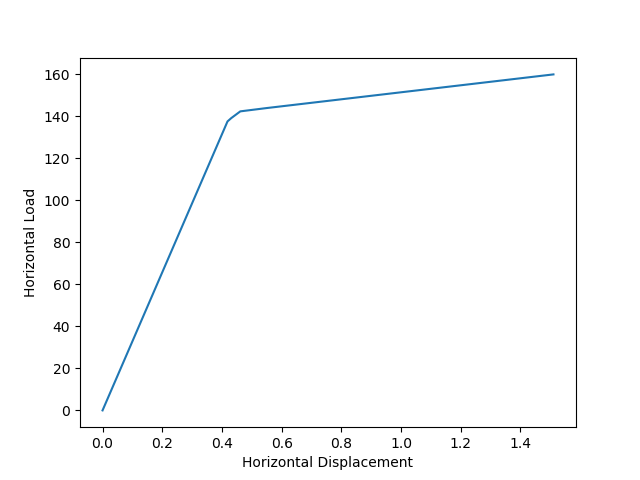
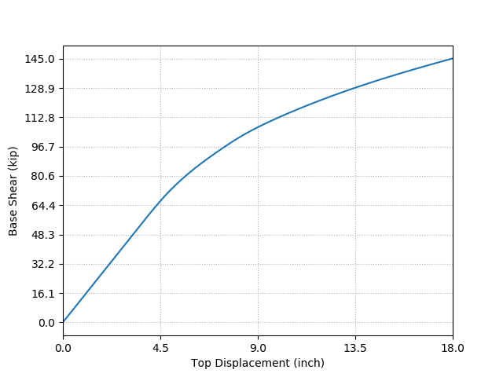
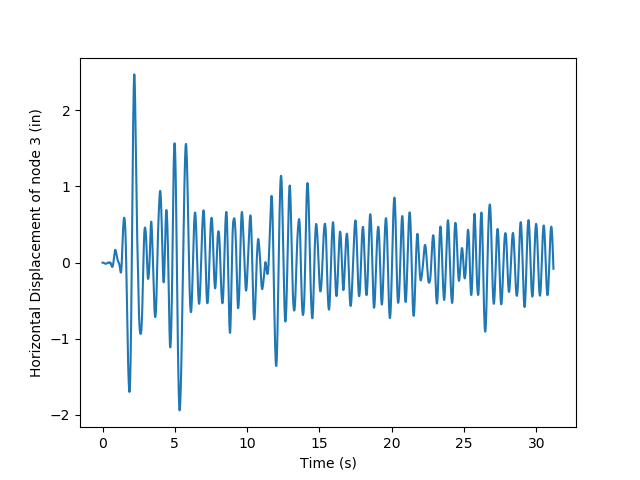

# Examples of running OpenSees scripts that generate graphical output

These examples must be run in CCR's [OnDemand portal](https://ondemand.ccr.buffalo.edu)

All these examples take less thatn an hour to run, so we can use the debug queue.


Open a browser window to our [OnDemand portal](https://ondemand.ccr.buffalo.edu)

[UB-HPC & Faculty Cluster Desktop]

Cluster: UB-HPC  
Slurm Account: [Your Slurm account]  
Partition: [debug]  
Quality of Service: [debug]  
Number of Hours Requested: 1  
Number of Cores: 28  
Amount of Memory: 64000  

[Launch]

Once the Slurm job starts you can press the button that appears
[Launch UB-HPC & Faculty Cluster Desktop]

A new window will open with the GUI displayed.

Open a terminal with:
[Applications][Terminal Emulator]

cd to the directory where you want the test scripts and data to reside
In my test case:

```
cd /projects/academic/ccradmintest/tkewtest/OpenSees/test-x86_64
```

...and start the container shell
(change the path to your OpenSees .sif file)

```
apptainer shell -B /util:/util,/scratch:/scratch,/projects:/projects /projects/academic/ccradmintest/tkewtest/OpenSees/OpenSees-$(arch).sif
```

All the following examples are run from the "Apptainer> " prompt


## Nonlinear Truss Analysis

Example from: https://openseespydoc.readthedocs.io/en/latest/src/nonlinearTruss.html

Get the Python script

```
curl -o NonlinearTruss.py https://openseespydoc.readthedocs.io/en/latest/_downloads/0c20eb7d761b60e0696e00aa57510e17/NonlinearTruss.py
```

Run the Python script

```
python NonlinearTruss.py
```

This will output an image that should look like this:  



## Three story steel building with rigid beam-column connections and W-section

Example from: https://openseespydoc.readthedocs.io/en/latest/src/ThreeStorySteel.html

Get the Python script

```
curl -o SteelFrame2D.py https://openseespydoc.readthedocs.io/en/latest/_downloads/8d5d91915a61abfb0ffc8cb10f3799f6/SteelFrame2D.py
```

Run the Python script

```
python SteelFrame2D.py
```

This will output an image that should look like this:  


The script also creates a subdirectory with three output files:

```
ls -l PushoverOut
```

sample output:

> ```
> total 7
> -rw-r--r-- 1 [CCRusername] nogroup 3414 Jul  1 15:51 BeamStress.out
> -rw-r--r-- 1 [CCRusername] nogroup 1606 Jul  1 15:51 Node2React.out
> -rw-r--r-- 1 [CCRusername] nogroup 1188 Jul  1 15:51 Node31Disp.out
> ```


## Reinforced Concrete Frame Earthquake Analysis

Example from: https://openseespydoc.readthedocs.io/en/latest/src/RCFrameEarthquake.html

Get the Python scripts and datafile

```
curl -o RCFrameEarthquake.py https://openseespydoc.readthedocs.io/en/latest/_downloads/e4cb079f1fb09a84502fde0c25d746f6/RCFrameEarthquake.py
curl -o RCFrameGravity.py https://openseespydoc.readthedocs.io/en/latest/_downloads/c5216600efa55eb2f4414ae80ad646a5/RCFrameGravity.py
curl -o ReadRecord.py https://openseespydoc.readthedocs.io/en/latest/_downloads/4bbb38382532173be5eed9157d71a571/ReadRecord.py
curl -o elCentro.at2 https://openseespydoc.readthedocs.io/en/latest/_downloads/a2ccdc9904970ec85b147cbf6095639b/elCentro.at2
```

Run the Earthquake Analysis

```
python RCFrameEarthquake.py
```

This will produce the following text outpu:

> ```
> ==========================
> Start RCFrameEarthquake Example
> ==========================
> Starting RCFrameGravity example
> Passed!
> ==========================
> Gravity Analysis Completed
> eigen values at start of transient: [266.85892074526, 17504.42256823814]
> eigen values at end of transient: [159.95037944428208, 17300.4694821994]
> Passed!
> ==========================
> ```

As well as an image that should look like this:  



...and a couple of output files:

```
ls -l elCentro.dat results.out
```

sample output:

> ```
> -rw-r--r-- 1 [CCRusername] nogroup 15802 Jul  1 16:01 elCentro.dat
> -rw-r--r-- 1 [CCRusername] nogroup    57 Jul  1 16:01 results.out
> ```


# Exit the OnDemand session with:

[Appliations] [Log Out] [Log Out]  
Close the browser window  
In the OnDemand Sessions window the session should be Completed, if not
[Cancel] the job.  
Delete the record of the completed interactive session with:  
[Delete] [OK]

